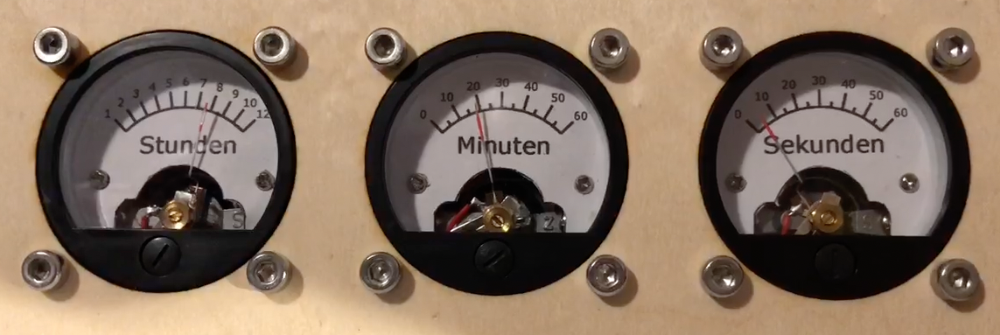

Aktuelle Version in Production: anaclock_light_lolin.yaml


Video: [](Media/AnaClock.mov "Video of the analog clock in action")

Und ja: die "11" fehlt...

Compile and run:

```docker run --rm -v "${PWD}":/config --device=/dev/ttyUSB0 -it esphome/esphome run anaclock_lolin.yaml```
